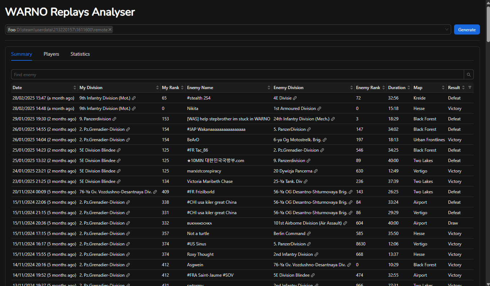
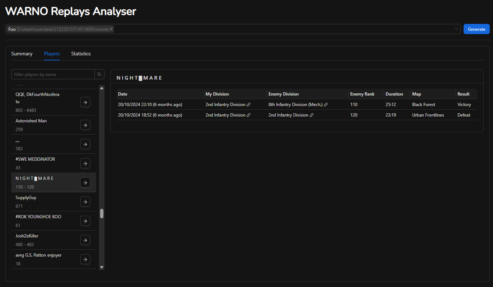
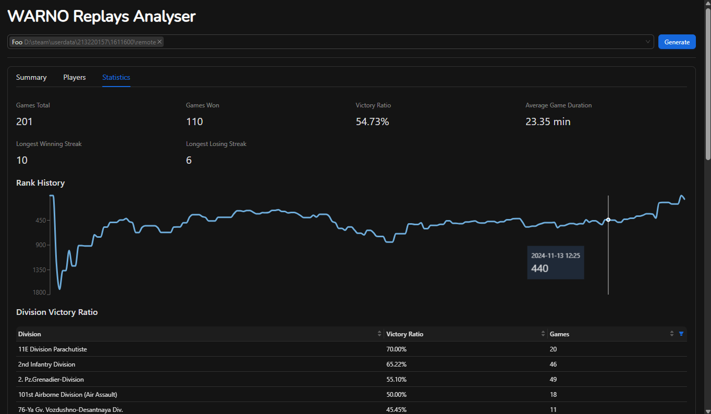

# warno-replays-analyser

## Screenshots
<div style="display: flex; justify-content: flex-start; gap: 20px;">
  <a href="screenshots/1.png" target="_blank">
    
  </a>
  <a href="screenshots/2.png" target="_blank">
    
  </a>
  <a href="screenshots/3.png" target="_blank">
    
  </a>
</div>

## Installing
You can download the latest `.exe` or installer from the [Releases](https://github.com/Kraku/warno-replays-analyser/releases) page.

## Building
#### Prerequisites
1. Ensure you have Go installed. You can download it from [golang.org](https://golang.org/dl/).
2. Install Wails by following the instructions on the [Wails installation page](https://wails.io/docs/gettingstarted/installation).

#### Building the Application
Once Wails is installed, you can build the application by running:
```bash
wails build
wails build -nsis // with installer
```
